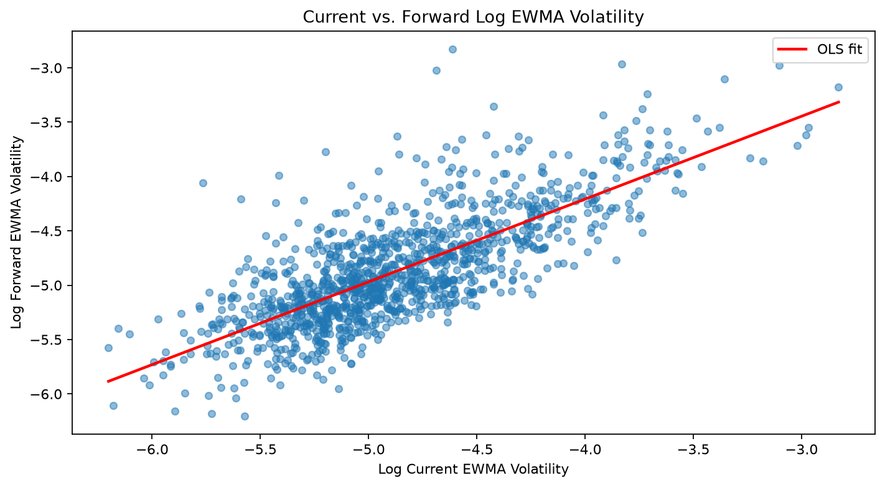
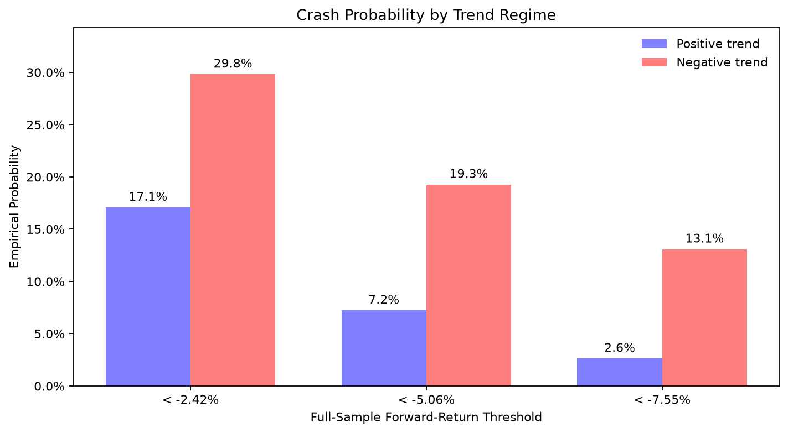
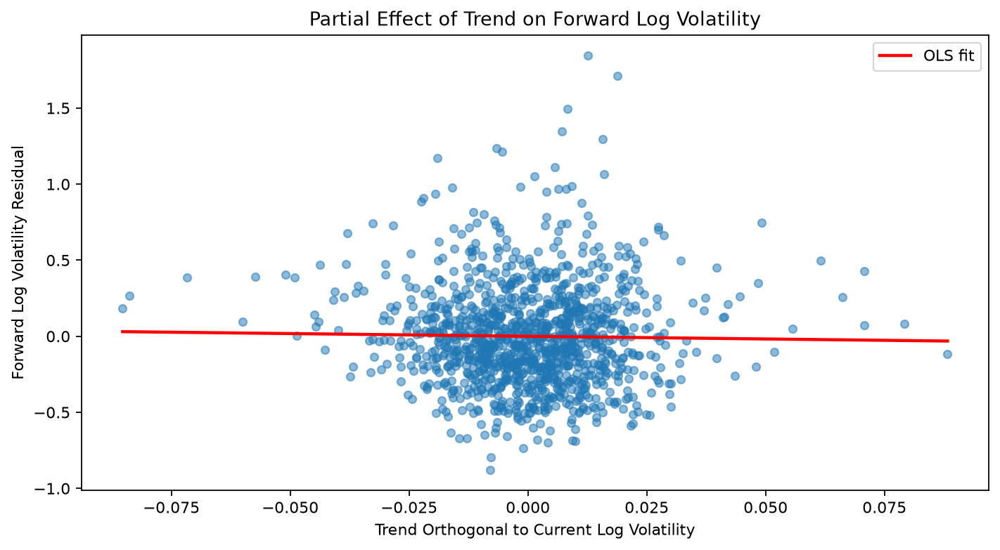
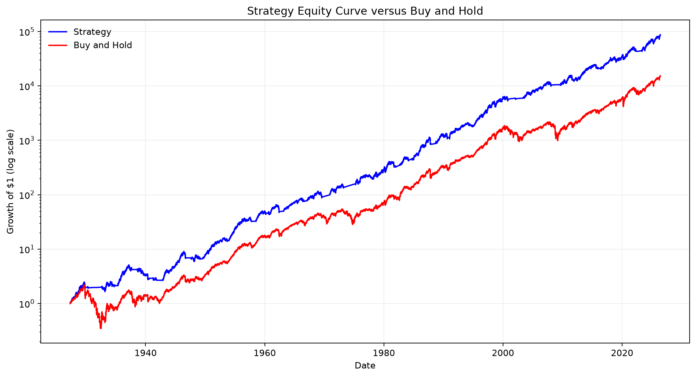
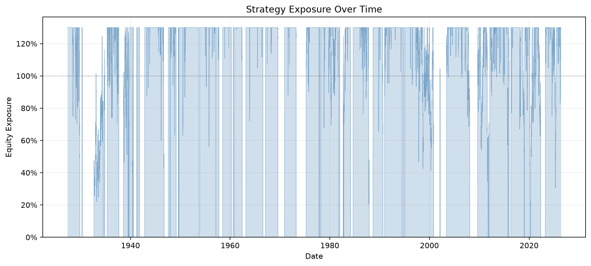
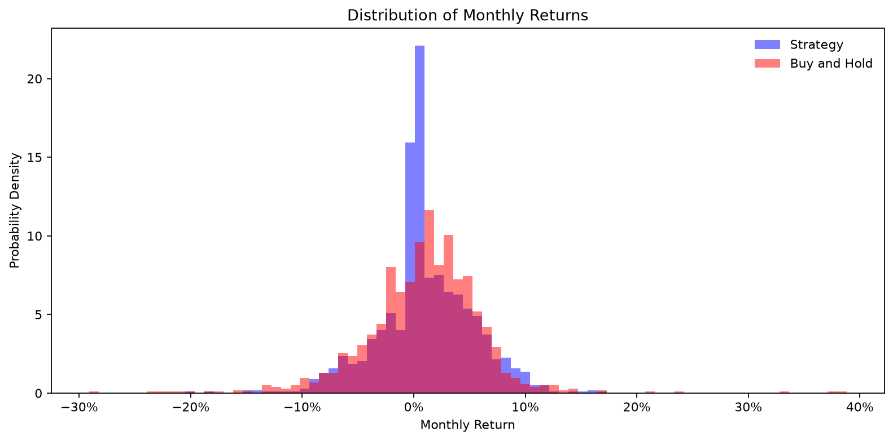

# Trend and Volatility Timing for U.S. Equities

This project studies whether a 10-month return trend and a fast volatility
estimate identify changes in the risk of the U.S. equity market. The evidence
suggests that trend is more useful as a **tail-risk filter** than as a forecast
of average returns, while current volatility is highly informative about
near-term volatility. The backtest combines those findings by holding no equity
during negative-trend months and targeting 18% annualized volatility otherwise.

## Main findings

- **Volatility is persistent.** Monthly forward log EWMA volatility has a slope
  of 0.762 on current log EWMA volatility and an R-squared of 58.2%.
- **Negative trend identifies substantially greater tail risk.** A return below
  the full-sample 20th percentile occurred in 29.8% of negative-trend months,
  compared with 17.1% of positive-trend months. The separation grows deeper in
  the tail: 13.1% versus 2.6% below the 5th-percentile cutoff.
- **Trend has little standalone relationship with average next-month return.**
  Its predictive regression has an R-squared of 0.2% and a p-value of 0.158.
  Positive-trend months earned 0.79 percentage points more on average, but the
  difference has a two-sided p-value of 0.098.
- **Trend does not add material information to current volatility when
  predicting forward volatility.** Once current log volatility is included,
  orthogonalized trend has a coefficient of -0.355 and a p-value of 0.546.
- **The combined strategy improved historical risk-adjusted performance.** It
  produced an 11.66% annualized geometric return with 13.05% arithmetic
  volatility and a 0.68 Sharpe ratio, versus 9.79%, 17.17%, and 0.45 for buy and
  hold. Its maximum drawdown was -47.68%, compared with -84.07%.

## Key evidence

### Volatility persists



The persistence regression supports using the latest volatility estimate to
scale near-term exposure. The strategy re-estimates the relationship through
time with an expanding window rather than using the full-sample coefficients.

### Trend primarily identifies tail risk



Negative-trend periods have a much greater empirical probability of crossing
each common lower-tail threshold. The bottom-quintile difference is also
statistically significant in a one-sided proportions test (z = -4.624,
p = 1.88e-06).

### Trend adds little to a current-volatility forecast



The nearly flat partial-regression line shows that the raw relationship between
trend and forward volatility is largely explained by trend's relationship with
current volatility.

## Strategy

The backtest runs from **May 2, 1927 through May 29, 2026** and uses only
information available before each realized strategy return:

1. At the beginning of each month, calculate the arithmetic mean of the prior
   10 completed monthly market returns. Hold no equity if this trend is
   negative.
2. Each day, fit an expanding OLS regression of next-day log EWMA volatility on
   current log EWMA volatility, using observed training pairs only.
3. Convert predicted log volatility back to ordinary volatility and choose the
   next day's exposure to target 18% annualized volatility.
4. Cap equity exposure at 1.3x. Uninvested cash earns the Fama-French risk-free
   return, and leverage is financed at the same rate.

Taxes, transaction costs, slippage, and market impact are not deducted.

### Performance

All return and volatility figures are annualized. Sharpe ratios use daily excess
returns. Turnover is one-way annual turnover based on changes in target
exposure.

| Statistic | Combined strategy | Trend only | Buy and hold |
|---|---:|---:|---:|
| Arithmetic mean | 11.89% | 10.71% | 10.82% |
| Arithmetic standard deviation | 13.05% | 13.14% | 17.17% |
| Arithmetic Sharpe | 0.68 | 0.59 | 0.45 |
| Geometric mean | 11.66% | 10.34% | 9.79% |
| Geometric standard deviation | 13.98% | 14.09% | 18.76% |
| Maximum drawdown | -47.68% | -46.05% | -84.07% |
| Average of five worst drawdowns | -33.93% | -36.91% | -54.57% |
| Average exposure | 92.49% | 76.48% | 100.00% |
| Time in market | 76.48% | 76.48% | 100.00% |
| Annual turnover | 333.23% | 85.28% | 0.00% |



The combined strategy's higher average exposure than its time in market reflects
the use of leverage in calm, positive-trend periods.





## Findings by script

| Script | Purpose and result |
|---|---|
| `download.py` | Downloads the Fama-French daily market factor and risk-free return. `stock_mkt` remains the total market return (`Mkt-RF + RF`), while `RF` supports cash and financing calculations. |
| `vol_plots.py` | Illustrates volatility clustering in daily returns and the response of the 21-day EWMA estimator. From 1990 onward, the sample daily mean is 0.0482% and standard deviation is 1.1388%. [EWMA figure](figures/ewma_vol_est.png) |
| `vol_persistence.py` | Regresses next month's log EWMA volatility on current log EWMA volatility. The slope is 0.762, R-squared is 58.2%, and the coefficient is highly significant. [Persistence figure](figures/volatility_persistence.png) |
| `trend_and_vol.py` | Finds a strong raw negative relationship between trend and forward log volatility (R-squared 7.7%), but no incremental trend effect after current log volatility is controlled for (p = 0.546). [Partial-regression figure](figures/trend_partial_volatility.png) |
| `trend_and_avg_return.py` | Finds little linear predictability of next-month mean returns from the continuous trend signal (R-squared 0.2%, p = 0.158). Positive-trend returns average 1.13% versus 0.35% in negative-trend months, with p = 0.098 for the difference. [Return scatter](figures/trend_next_month_return.png) |
| `tail_behavior.py` | Shows that negative-trend months have materially higher lower-tail event probabilities. Bottom-quintile probability rises from 17.1% to 29.8%. Negative-trend months also contain more top-quintile rallies (26.6% versus 18.1%), indicating generally wider tails. [Tail probabilities](figures/tail_loss_probabilities.png) |
| `downtrend_continuation.py` | In the crash logistic regression, positive trend reduces crash log odds after controlling for volatility (coefficient -0.214, p = 0.014), while higher log volatility raises them (0.631, p < 0.001). Trend is insignificant for rallies after controlling for volatility (p = 0.992), while volatility remains strongly positive. |
| `backtest.py` | Implements the lookahead-safe trend gate and expanding volatility forecast, prints performance for the combined strategy, trend-only strategy, and buy and hold, and displays the equity, exposure, and monthly-return-distribution figures. |

## Running the analysis

Install `numpy`, `pandas`, `matplotlib`, `scipy`, `statsmodels`, and
`pandas-datareader`, then refresh the input data if needed:

```powershell
python download.py
```

Each analysis is a standalone script. For example:

```powershell
python tail_behavior.py
python backtest.py
```

## Interpretation and limitations

- Results are historical and largely in-sample; they do not establish that the
  strategy will retain the same performance out of sample.
- The 10-month trend horizon, 18% volatility target, and 1.3x cap are fixed
  research choices. Selecting them after inspecting the same history can create
  data-mining bias even though the backtest's daily signals contain no direct
  lookahead.
- The strategy assumes an end-of-day signal can set exposure for the following
  close-to-close return. A more conservative implementation could impose an
  additional execution lag.
- The combined strategy's 333% annual turnover is economically important.
  Because trading costs are excluded, realized net performance would be lower.
- Fama-French historical data may be revised, so this is not a point-in-time
  data-vintage test.

